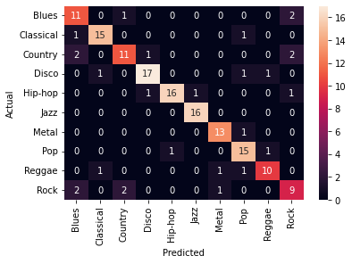
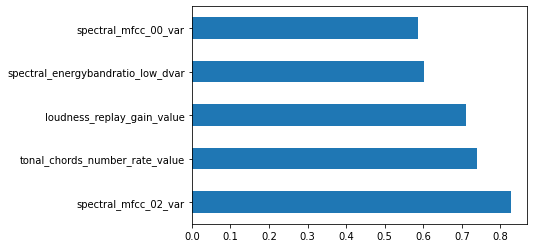

# Music genre classification using Machine Learning
### Feature-based classification of music genre using SVM with Scikit-Learn.

## Summary
This project aims to develop a music genre classifier using Machine Learning algorithms with [Scikit-Learn](https://scikit-learn.org/). The classifier is trained on a dataset of precomputed audio features labeled with their genre, and uses a Support Vector Machine (SVM) with a linear kernel to predict the genre of new audio files based on their features.

## Dataset

The dataset used for this project consists of the audio features of songs corresponding to 10 different genres: Blues, Classical, Country, Disco, Hip-hop, Jazz, Metal, Pop, Reggae, and Rock. For each audio file a set of 240 audio features labeled with its corresponding genre is provided in an [ARFF file](https://www.cs.waikato.ac.nz/ml/weka/arff.html).

## Installation

To run this project, Python 3 and several Python libraries need to be installed, including Scikit-Learn, Pandas, Numpy, Matplotlib, Seaborn, and Scipy. You can install these libraries using:

```
pip install scikit-learn pandas numpy matplotlib seaborn scipy
```

## Usage

To use this classifier, you need to follow these steps:

1. Download or clone the GitHub repository [here](https://github.com/username/Music-Genre-Classification/blob/main/Genre.arff).

2. Open the Jupyter notebook `GenreClassificationML.ipynb` and run all the cells.

3. The notebook will load the dataset, preprocess it, train the SVM classifier, and evaluate its performance using cross-validation and a confusion matrix. It will also show the five features with the largest weight on the classification.

4. You can modify the parameters of the SVM classifier, such as the kernel or the regularization parameter, to see if you can improve its performance.

## Results

The classification is not perfect, but it achieves an average accuracy of about 82.5% using 10-fold cross-validation. There are some missclassifications due to the similarity between genres (country/blues, classical/jazz, rock/country...)

The confusion matrix for the classification is the following:


And the 5 most important features for the classification are:


## Credits

This project was developed by [Alberto Barrera](https://github.com/ABsoundsDSP) as part of the [Advanced Topics in SMC](https://www.upf.edu/web/smc/advance-topics-in-smc) course at UPF.